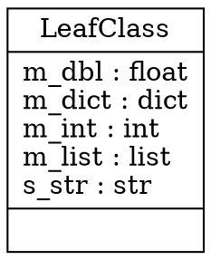

# pyreverse_behavior
A series of projects to examine real life pyreverse behavior across a variety of project designs.

# Single File Project No \_\_init\_\_.py file
In this folder `single_file_proj_no_init` there is a single python module and within a folder that has no `__init__.py` file present (ie namespace only package).

If we run pyreverse on this folder without anything else specified we attain the following

```
>pyreverse single_file_proj_no_init
parsing single_file_proj_no_init\__init__.py...
Failed to import module __init__ with error:
No module named __init__.
```

However if we instead single out the specific file in that folder we can get things to work as expected.

```
>pyreverse single_file_proj_no_init\source.py 
parsing single_file_proj_no_init\source.py...
```

There is no indication of output from the console other than the presence of a new file `classes.dot` in the cwd.

This file has the following contents



We can export this to an svg file with the following command
```bash
python gen_svg.py
```

